# Fast-Track Innovations with Agile Design Thinking and Generative AI (GenAI) — Learner Guide

**WSQ Course Code:** TGS-2024049781  |  **Conducted by:** Tertiary Infotech Academy Pte Ltd (UEN 201200696W)  |  **Version v4.0 · 17 August 2026**

## Contents

- [Introduction](#introduction)
- [Course Learning Outcomes](#course-learning-outcomes)
- [Skills Framework Alignment](#skills-framework-alignment)
- [Before You Start — Your Course Tools](#before-you-start--your-course-tools)
  - [Design Thinking Studio](#design-thinking-studio)
  - [Padlet Classroom Board](#padlet-classroom-board)
  - [Your Generative AI Assistant](#your-generative-ai-assistant)
- [Topic 1 — Foundations of Design Thinking, Agile, and Generative AI](#topic-1--foundations-of-design-thinking-agile-and-generative-ai)
  - [What Design Thinking Is](#what-design-thinking-is)
  - [The Three Mindsets — Design Thinking, Lean and Agile](#the-three-mindsets--design-thinking-lean-and-agile)
  - [The Double Diamond](#the-double-diamond)
  - [The Five Stages of Design Thinking](#the-five-stages-of-design-thinking)
  - [Wicked Problems](#wicked-problems)
  - [How Generative AI Enhances the Loop](#how-generative-ai-enhances-the-loop)
  - [Latest Trends in Innovation](#latest-trends-in-innovation)
- [Topic 2 — Problem Framing and Ideation: Leveraging Design Thinking and Generative AI](#topic-2--problem-framing-and-ideation-leveraging-design-thinking-and-generative-ai)
  - [Framing the Design Challenge](#framing-the-design-challenge)
  - [Problem Statement, Point of View and How Might We](#problem-statement-point-of-view-and-how-might-we)
  - [The Problem-Assumption Model](#the-problem-assumption-model)
  - [Empathy Maps](#empathy-maps)
  - [Persona Mapping](#persona-mapping)
  - [Ideation Techniques](#ideation-techniques)
  - [Prototyping and Testing](#prototyping-and-testing)
- [Topic 3 — Agile Development and AI for Rapid Solution Delivery](#topic-3--agile-development-and-ai-for-rapid-solution-delivery)
  - [Being Agile versus Doing Agile](#being-agile-versus-doing-agile)
  - [Scrum](#scrum)
  - [Dual-Track Agile](#dual-track-agile)
  - [Converting Ideas into Agile Artefacts](#converting-ideas-into-agile-artefacts)
  - [Release Prioritisation — The Three-Cake Model](#release-prioritisation--the-three-cake-model)
  - [Agile Estimation](#agile-estimation)
  - [Ceremonies, Artefacts and Information Radiators](#ceremonies-artefacts-and-information-radiators)
  - [GenAI Across the Sprint](#genai-across-the-sprint)
- [Topic 4 — Scaling and Sustaining Innovations with Agile Design Thinking and Generative AI](#topic-4--scaling-and-sustaining-innovations-with-agile-design-thinking-and-generative-ai)
  - [The Three Levers That Actually Scale Innovation](#the-three-levers-that-actually-scale-innovation)
  - [Culture — The Four Principles](#culture--the-four-principles)
  - [Engaging Stakeholders and Creating Buy-In](#engaging-stakeholders-and-creating-buy-in)
  - [Resource Management in Innovation Projects](#resource-management-in-innovation-projects)
  - [Sensemaking](#sensemaking)
  - [Systems Thinking](#systems-thinking)
  - [Metrics and KPIs for Innovation](#metrics-and-kpis-for-innovation)
- [Hands-On Activities](#hands-on-activities)
  - [Activity 1 — Airbnb — Diagnosing Why a Method Alone Does Not Save a Business](#activity-1--airbnb--diagnosing-why-a-method-alone-does-not-save-a-business)
  - [Activity 2 — Netflix vs Blockbuster — Innovation as an Operating System](#activity-2--netflix-vs-blockbuster--innovation-as-an-operating-system)
  - [Activity 3 — Positioning GenAI in the Innovation Loop — Where It Helps and Where It Lies](#activity-3--positioning-genai-in-the-innovation-loop--where-it-helps-and-where-it-lies)
  - [Activity 4 — GE Adventure Series — Reframing the Problem Instead of Fixing the Machine](#activity-4--ge-adventure-series--reframing-the-problem-instead-of-fixing-the-machine)
  - [Activity 5 — IDEO Shopping Cart — Volume, Then Judgement](#activity-5--ideo-shopping-cart--volume-then-judgement)
  - [Activity 6 — Rapid Prototyping with AI — From Concept to Testable Artefact in One Hour](#activity-6--rapid-prototyping-with-ai--from-concept-to-testable-artefact-in-one-hour)
  - [Activity 7 — Spotify — Reading a Scaling Model Honestly](#activity-7--spotify--reading-a-scaling-model-honestly)
  - [Activity 8 — From Hills to Backlog — Converting Ideas into Stories with GenAI](#activity-8--from-hills-to-backlog--converting-ideas-into-stories-with-genai)
  - [Activity 9 — Running Dual-Track Agile — A Sprint Simulation with AI Assistance](#activity-9--running-dual-track-agile--a-sprint-simulation-with-ai-assistance)
  - [Activity 10 — DBS Bank — Scaling Innovation Across 25,000 People](#activity-10--dbs-bank--scaling-innovation-across-25000-people)
  - [Activity 11 — Boeing 737 MAX — Systems Thinking and the Cost of Local Optimisation](#activity-11--boeing-737-max--systems-thinking-and-the-cost-of-local-optimisation)
  - [Activity 12 — Innovation Metrics — Designing KPIs That Change a Decision](#activity-12--innovation-metrics--designing-kpis-that-change-a-decision)
- [Preparing for the Assessment](#preparing-for-the-assessment)
- [Glossary](#glossary)
- [References and Further Reading](#references-and-further-reading)

## Introduction

This Learner Guide accompanies the WSQ course Fast-Track Innovations with Agile Design Thinking and Generative AI (GenAI) (TGS-2024049781), conducted by Tertiary Infotech Academy Pte Ltd (UEN 201200696W). It is your reference during the two training days and your working manual afterwards.

The guide is organised into four topics that match the slide deck and the Lesson Plan exactly. Each topic opens with the teaching content — the frameworks, comparisons and models you will be assessed on — and then works through its real-world case-study activities. For every activity you will find the documented case, the workplace scenario your group works on, the full step-by-step instructions, the discussion questions, and the debrief that states what the room should conclude.

> **Note:** The detailed step-by-step instructions appear in this guide and in the individual activity briefs — deliberately NOT on the slides. The slides carry the case, the scenario and the questions so that the class discusses rather than reads. Follow the steps from here.

This is an open-book course. You may use this guide, the slides, your activity briefs and any approved material during the final assessment.

## Course Learning Outcomes

On completion of this course you will be able to:

- LO1: Integrate design thinking methodologies and agile principles to drive organisational innovation using generative AI.
- LO2: Synthesise stakeholder inputs to uncover end-user needs for successful innovation.
- LO3: Lead design thinking projects using project management tools and techniques to enhance organisational performance.
- LO4: Develop strategies for agile design thinking to enhance product and service innovation.

## Skills Framework Alignment

This course is aligned to the Skills Framework Technical Skill and Competency Design Thinking Practice (ICT-ACE-5014-1.1).

**Abilities**

- A1 – Integrate design thinking methodologies into processes to drive innovation across the organisation
- A2 – Develop strategies to proliferate design thinking across the organisation
- A3 – Synthesise information from different sources and stakeholders in order to fully understand the needs of end users
- A4 – Drive the development of new strategies to enhance products and/or services for the organisation
- A5 – Engage stakeholders during the design thinking process to uncover the motivations behind their actions and behaviours
- A6 – Cultivate design thinking as a viable tool and methodology to foster new innovations for the organisation
- A7 – Lead design thinking projects across the organisation

**Knowledge**

- K1 – Latest trends in design thinking
- K2 – Concept of innovation management
- K3 – Drivers of organisational growth and success
- K4 – Concept and principles of resource management
- K5 – Project management tools and techniques

## Before You Start — Your Course Tools

Two collaborative web tools are used throughout this course. Both run in a browser, need no installation and no account, and are shared by the whole class. Bring a laptop; a phone works but is cramped for the workspace tool.

### Design Thinking Studio

Design Thinking Studio is a shared five-stage workspace at https://alfredang.github.io/designthinking/. The whole class works inside one live workspace and posts notes into structured sections under each of the five design thinking stages.

**How to join a workspace**

1. Open https://alfredang.github.io/designthinking/ in your browser.
2. The trainer clicks Create New Workspace and shares the workspace code, the link, or a QR code (via the Share button).
3. Enter the workspace code in the 'Enter workspace code' field and click Join Workspace.
4. Enter your display name when prompted, then click Continue. Your name appears on every note you post.
5. Use the stage stepper across the top to move between Empathize, Define, Ideate, Prototype and Test.
6. Inside any section click Add note, then fill in the Title, the Description and an optional Category, and click Save.

**What is in each stage**

| Stage | Sections available |
|---|---|
| 1. Empathize | User Personas · User Pain Points · Interview Notes · Observation Notes · Empathy Map (Says / Thinks / Does / Feels) |
| 2. Define | Problem Statement (voting) · How Might We Questions (voting) · Key Insights · User Needs · Success Criteria |
| 3. Ideate | Brainstorming Board (voting) · Crazy 8s Ideas (voting) · Solution Sketches · Idea Categories · Voting & Prioritisation |
| 4. Prototype | Prototype Description · Screens / Wireframes · Feature List · User Flow · Assumptions · Prototype Checklist |
| 5. Test | Test Plan · User Feedback · Test Results · Issues Found · Improvements · Final Recommendations |

> **Note:** Sections marked with voting let the group mark notes as important — use this to converge. In the Test stage, Issues Found and Improvements can be marked resolved as you work through them.

### Padlet Classroom Board

The Padlet Classroom Board at https://alfredang.github.io/padlet/ is an online classroom board for posting group output, comparing it across groups and voting on the strongest thinking.

**How to join a classroom**

1. Open https://alfredang.github.io/padlet/ in your browser.
2. The trainer creates the classroom and shares the classroom code.
3. Click Join an existing classroom, enter the classroom code and click Join classroom.
4. Enter your display name so your posts are attributed to you.
5. Find the section for the current activity, then click + / Add post here.
6. Give the post a Subject and body. You may attach an image, a link, a YouTube video or a PDF.
7. Use Like on the strongest posts from other groups, and Comments to challenge their reasoning.

> **Note:** Sort the board by Newest first, Oldest first or Most liked. The trainer may pin an Announcement to the top of the board with the current task.

### Your Generative AI Assistant

You will use a generative AI assistant (ChatGPT, Microsoft Copilot or an equivalent) in most activities. Any current model is fine. Three working rules apply throughout this course:

- Generate manually FIRST, then use AI to extend. Running AI first anchors the whole group to its framing and measurably narrows the range of ideas in the room.
- Treat every AI output as a hypothesis, never as evidence. Label AI-generated personas, insights and metrics as unvalidated until real-world evidence confirms them.
- Never paste confidential, personal or client-identifying data into a public AI tool. Use anonymised or synthetic details in class.

---

## Topic 1 — Foundations of Design Thinking, Agile, and Generative AI

Topic weighting: 25%. This topic establishes the vocabulary for the whole course: what design thinking actually is, how it differs from lean and agile, and where generative AI genuinely helps rather than merely appearing to.

### What Design Thinking Is

Design Thinking is a solution-based approach to problem solving that is especially useful for problems that are ill-defined, ambiguous or simply unknown. It works by understanding the human needs involved, re-framing the problem in human-centred terms, generating many ideas in structured ideation sessions, and adopting a hands-on approach through prototyping and testing.

The central discipline is resisting your first plausible answer. When was the last time your first idea was your best idea? Everyone designs, consciously or not — if you are solving a problem, you are designing a solution. Design thinking is a mindset that helps you do it better.

**The abilities that make a designer**

Carissa Carter, head of teaching at the Stanford d.school, describes the abilities that distinguish strong designers:

- **Dealing with ambiguity** — Staying productive when the problem itself is still unclear. This is the defining skill of the discipline and the hardest to fake.
- **Empathetic learning** — Understanding a user's world from inside their experience, rather than from a survey summary or a dashboard.
- **Synthesis** — Turning a large mass of qualitative evidence into a small number of insights you can actually design against.
- **Experimentation** — Treating every belief as testable, and designing the cheapest test that could disprove it.

### The Three Mindsets — Design Thinking, Lean and Agile

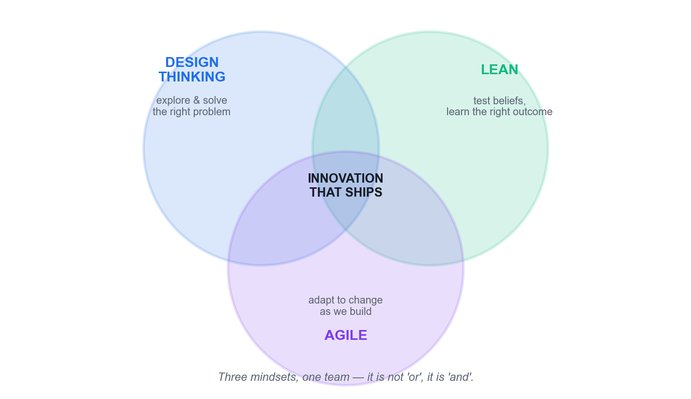

*The three mindsets of product development and where they overlap.*

The clearest formulation of how these three fit together comes from Thoughtworks:

> Design Thinking is how we explore and solve problems. Lean is our framework for testing our beliefs and learning our way to the right outcomes. Agile is how we adapt to changing conditions with software.

Compressed for memory: Design Thinking finds the RIGHT PROBLEM. Lean validates the RIGHT SOLUTION. Agile makes sure you BUILD IT RIGHT. They are completing, not competing — the question is never 'Lean or Agile?', it is 'and'.

|  | Design Thinking | Lean Startup | Agile |
|---|---|---|---|
| Primary focus | Understanding users deeply | Validating ideas efficiently | Iterative delivery and adaptation |
| The question it answers | How should we think about this problem? | How do we validate this solution efficiently? | How do we build, scale and improve it? |
| Origin | Human-centred design practice | Toyota lean manufacturing | A counterpoint to Waterfall |
| Core move | Reframe the problem through empathy | Build an MVP; let the customer determine value | Ship increments in short sprints |
| Timeframe | Flexible — one day to one month | Rapid, minimal validation cycles | Sprint-based and continuous |
| Fails when | It never reaches delivery | It validates a problem nobody has | It builds the wrong thing efficiently |

> **Note:** A critical caution from the same source: all three mindsets are commonly corrupted by being codified into rituals and certifications and rolled out mindlessly. They are mindsets, not processes.

**Problem finding versus problem solving**

The crispest two-word contrast: Design Thinking is problem FINDING; Agile is problem SOLVING. Agile focuses on solving a predefined issue efficiently, and can become dysfunctional when user engagement is minimal. Design Thinking focuses on selecting the right issue to address in the first place, and only begins once you understand user needs.

PMI puts the same point in terms of destination: agile's iterative approach lets teams react to change and deliver finished products faster — but this is only valuable if it is the right destination to begin with.

### The Double Diamond

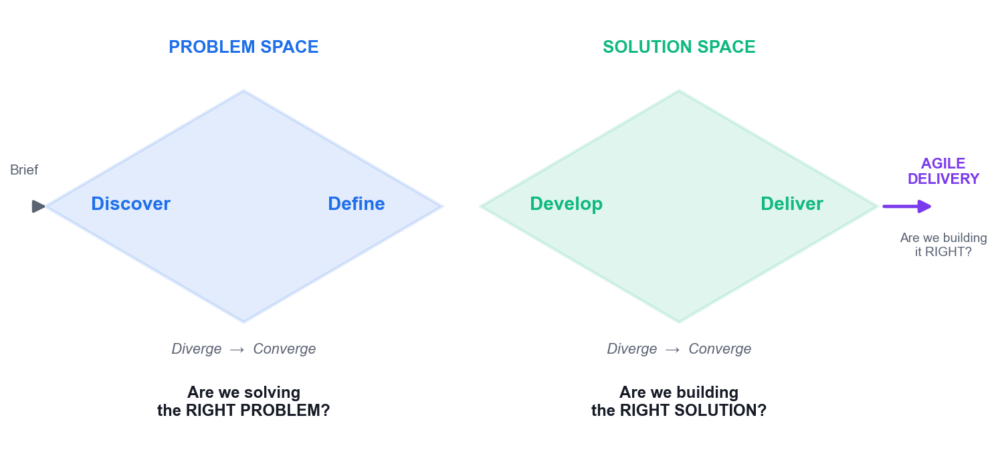

*The Double Diamond — the problem space and the solution space, each with a diverge and a converge phase.*

The Double Diamond describes innovation as two linked diamonds, each alternating divergent and convergent thinking.

- **Diamond 1 — the problem space** — Diverge by zooming out to understand the customer, their context and their needs. Converge by formulating a clear problem statement. This diamond answers: are we solving the right problem?
- **Diamond 2 — the solution space** — Diverge by ideating and testing multiple solutions. Converge by selecting the optimal one. This diamond answers: are we building the right solution?
- **Then agile delivery** — Sprints answer the third question: are we building it right?

> **Note:** The first diamond is the one teams skip under deadline pressure. Skipping it does not save time — it relocates the cost to the point where the wrong thing has already been built.

### The Five Stages of Design Thinking

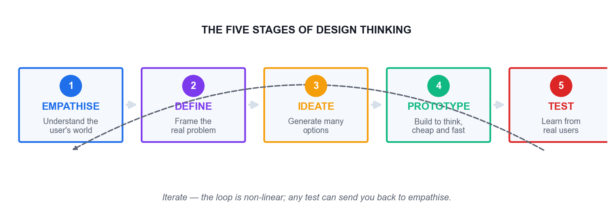

*The five stages — a loop you re-enter, not a waterfall you complete once.*

The five stages overlap and repeat continuously, with forward momentum on problem-solving always in play. The process is flexible and fluid by nature; a result at Test can send you straight back to Empathise.

**1. Empathise**

Understand the experience, situation and emotions of the person you are designing for. Observe users and their behaviour in the context of their lives. Engage people in conversation and ask why. Watch and listen: ask someone to complete a task and narrate what they are doing. Where possible, immerse yourself in the physical environment to gain a deeper personal understanding.

**2. Define**

Process and synthesise your findings to form a user Point of View that you will address. Develop an understanding of the type of person you are designing for, select a limited set of needs you think are important to fulfil, and express the insights you developed. Analyse your observations and synthesise them to define the core problem in a human-centred manner.

**3. Ideate**

Focus on idea generation. Translate problems into solutions. Explore a wide variety and a large quantity of ideas so you can go beyond the obvious. Combine conscious and unconscious thought with rational analysis and imagination. Leverage the group to reach new ideas and build on other people's. Critically: separate the generation of ideas from their evaluation, to give imagination a voice.

**4. Prototype**

Build to think. Create a simple, cheap and fast artefact that shapes the idea so you can experience and interact with it. Create something of deliberately low resolution — a physical object, a sketch, a paper screen. Quick and dirty is the point. Storyboard a scenario you can role-play so people can experience the solution.

**5. Test**

Ask for feedback. Let people use the prototype hands-on and listen to what they say. Let users talk and describe how they feel. Learn about the user, reframe your view and refine the prototype. Solutions are accepted, improved and re-examined, or rejected, on the basis of the users' experiences. Fail sooner rather than later.

### Wicked Problems

The term wicked problem was coined in 1973 by Horst Rittel and Melvin Webber, professors of design and urban planning at UC Berkeley. Wicked problems are abstract and difficult to define, with multiple interconnected layers — poverty, climate change, public health. Their defining property is that they have no fixed endpoint and no single correct solution, only better and worse responses.

A tame problem, by contrast, has a knowable answer. Reaching for a tame method on a wicked problem is one of the most common and expensive errors in organisational innovation, and it is precisely why framing must precede solving.

### How Generative AI Enhances the Loop

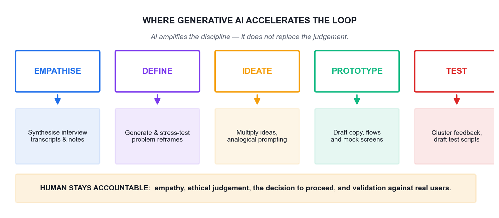

*Where generative AI accelerates each stage of the design thinking loop.*

Generative AI compresses the expensive parts of the innovation loop. A seven-year study of design thinking by Jeanne Liedtka at the University of Virginia's Darden School found that immersion in user experience provides rich raw material for insight, but that finding patterns and making sense of the resulting mass of qualitative data is a significant challenge. That documented bottleneck — sense-making across large volumes of qualitative evidence — is exactly what generative AI relieves.

| Stage | GenAI genuinely accelerates | What must stay human |
|---|---|---|
| Empathise | Synthesising interview transcripts and field notes at speed | Being in the room; noticing what is not said |
| Define | Generating and stress-testing candidate reframes | Choosing which problem the organisation will own |
| Ideate | Multiplying idea volume and range on demand | Recognising the idea that fits this context |
| Prototype | Drafting copy, flows, screens and edge cases | Deciding what is cheap enough to learn from |
| Test | Clustering feedback and drafting test scripts | Watching a real user hesitate, and asking why |

> AI acts as an amplifier of good Agile and Design Thinking discipline rather than a substitute for it. The quality of outcomes still depends on the rigor of the underlying process and the judgment of the people running it.

> **Note:** A language model generates the statistically likely, not the locally true. That is what you want for divergence, and what you must not trust for convergence.

### Latest Trends in Innovation

- **AI-assisted discovery** — Research synthesis that took a team weeks now takes hours; the bottleneck moves from analysis to judgement.
- **Continuous discovery** — Discovery is no longer a phase that precedes delivery — it runs permanently alongside it.
- **Cross-functional trios** — A product manager, a designer and an engineer own discovery together rather than passing artefacts down a chain.
- **Evidence over opinion** — Decisions increasingly require a named assumption and the test that would disprove it.
- **Responsible AI** — Provenance, bias and governance become part of the innovation process rather than a legal afterthought.
- **Outcome over output** — Organisations shift from counting features shipped to measuring the customer value created.

---

## Topic 2 — Problem Framing and Ideation: Leveraging Design Thinking and Generative AI

Topic weighting: 25%. This topic covers the highest-leverage move in the whole discipline — turning a technical brief into a human problem — and then the disciplined generation and convergence of ideas against it.

### Framing the Design Challenge

Human-centred design, as IDEO describes it, is an approach to problem-solving based on techniques that communicate with, interact with, empathise with and stimulate the people involved, in order to understand their needs, desires and experiences.

Framing is about turning problems into opportunities and organising the possible solutions. At moments of ambiguity it clarifies where you should push your design. Follow six steps:

1. Write your design challenge — one short, memorable sentence conveying the problem you want to solve. For example: make families spend more time together.
2. Frame it as a question, specifically a 'How Might We' question. For example: How might we help families spend more time together?
3. Define the impact you would like to have in light of that challenge.
4. Think about possible solutions to the problem — without committing to any of them yet.
5. Write down the context and the constraints that surround the original question.
6. Look back at your How Might We question and revise it. It is very common to adapt it as you dig deeper.

**The altitude test**

The most common mistake is a How Might We question that is either too broad or too narrow.

- TOO NARROW: you can immediately name only one obvious solution — the answer is hiding inside the question. 'How might we send an SMS reminder?' is a solution wearing a question mark.
- TOO BROAD: you cannot picture any concrete answer at all. 'How might we improve healthcare?' invites nothing actionable.
- JUST RIGHT: many different answers are imaginable, and you could test each of them. 'How might we make a first screening feel safe rather than exposing?'

### Problem Statement, Point of View and How Might We

| Artefact | What it is | Example |
|---|---|---|
| Problem statement | A neutral description of what is wrong | Elderly patients miss their screening appointments. |
| Point of View (POV) | [User] needs [need] because [insight] | Mdm Tan needs to feel safe asking questions because she fears being judged for not understanding. |
| How Might We (HMW) | An invitation to generate solutions | How might we make a first screening feel safe rather than exposing? |
| The failure mode | A solution disguised as a problem | 'We need an SMS reminder system.' That is an answer, not a problem. |

The Point of View is where raw research becomes a designable problem. Skip it and your How Might We question floats free of evidence — it will sound reasonable and lead nowhere.

### The Problem-Assumption Model

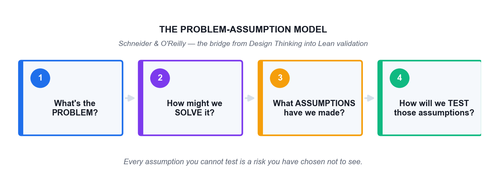

*The Problem-Assumption Model (Schneider & O'Reilly) — the bridge from Design Thinking into Lean validation.*

The Problem-Assumption Model, created by Jonny Schneider and Barry O'Reilly, is a four-question worksheet that converts a belief into a test:

1. What's the problem?
2. How might we solve it?
3. What assumptions have we made?
4. How will we test our assumptions?

It rests on a three-step learning discipline: define your beliefs and assumptions so that they can be tested; decide the most important thing to learn; then design the experiments that will deliver that learning.

> **Note:** Every assumption you cannot test is a risk you have chosen not to see.

### Empathy Maps

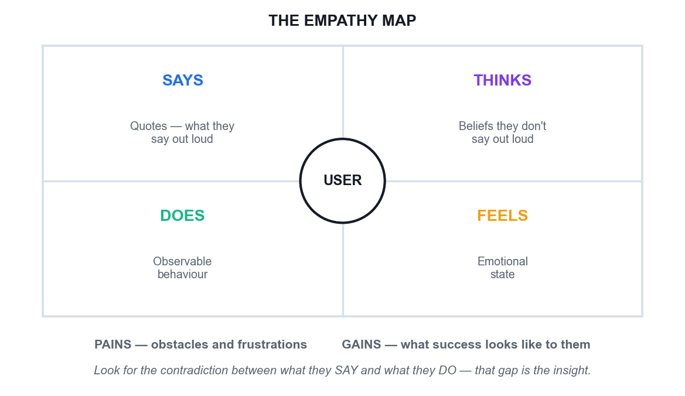

*The empathy map — four quadrants plus pains and gains.*

An empathy map captures four things about a user, and two more at the base:

- **Says** — Direct quotes — what the user says out loud. Observable and quotable.
- **Thinks** — What the user believes but does not say out loud. This is inference; label it as such.
- **Does** — Observable behaviour, either in general or in response to a specific trigger.
- **Feels** — The user's emotional state — for example, 'is confused by the navigation and blames themselves'.
- **Pains** — Obstacles and frustrations worth considering — unfamiliarity with technology, a short attention span, fear of a bad result.
- **Gains** — What the user hopes to accomplish, and what success looks like in their own terms.

> **Note:** The most valuable thing on an empathy map is a contradiction between what the user SAYS and what they DO. That gap is almost always where the real insight lives.

**Common empathy methods**

- **Interviews** — Gathering in-depth insight through direct conversation. Ask why repeatedly.
- **Observation** — Watching the task performed in its real context, without intervening.
- **Questionnaires** — Collecting structured data from a larger audience — breadth, not depth.
- **Focus groups** — Facilitating dynamic group discussion to surface shared and contested views.
- **Workshop sessions** — Collaborative problem-solving and idea generation with the users themselves.

### Persona Mapping

User personas are representations of your target customers, built by researching and outlining your ideal customer's goals, pain points, behaviours and demographic information.

- Create three to five detailed personas to start — enough to show meaningful variation, few enough for the team to hold in mind.
- Ground every claim. Each goal, pain and behaviour should trace back to something a real person said or did.
- Include the awkward persona. The user who does not fit the happy path is usually where your design breaks.
- Keep layouts consistent between personas and find a common metric to track across them, so they can be compared.
- Use icons and visuals to make the data memorable, and present all personas on one page for easy comparison.
- Label AI-generated personas as hypotheses. An AI persona is a compression of what the internet says, not evidence about your users.
- Retire personas honestly. A persona contradicted by evidence must be changed, not defended.

### Ideation Techniques

- **Brainstorming** — Group generation under explicit rules — defer judgement, encourage wild ideas, build on the ideas of others, go for quantity, stay focused, one conversation at a time, be visual.
- **Brainwriting** — Silent written generation before any discussion, which prevents the loudest voice in the room from anchoring everybody else.
- **Crazy 8s** — Eight rapid variations in eight minutes. The speed is the mechanism: it defeats the internal critic.
- **Worst Possible Idea** — Deliberately generate terrible ideas to break the fear of contributing, then invert the best of the worst.
- **SCAMPER** — Substitute, Combine, Adapt, Modify, Put to another use, Eliminate, Reverse — a systematic prompt set for variation.
- **AI amplification** — Generate manually first, then use GenAI to extend the set. Never the reverse.

> **Note:** The one rule of ideation: separate the generation of ideas from the evaluation of ideas. Judging while generating kills the unusual ideas first — and the unusual idea is the one you came for.

### Prototyping and Testing

A prototype's job is to buy information at the lowest possible price. It is built to think, not built to ship.

- Low fidelity invites honesty. A rough paper screen gets real objections; a polished mockup gets polite notes about the font.
- Wizard of Oz: fake the mechanism with a human behind the curtain, and learn the behaviour before building anything.
- Storyboard the experience as a strip so the team can role-play it and feel where it breaks.
- Write the falsification criteria in advance. State what result would prove the concept wrong — otherwise you have a demonstration, not a test.
- Use GenAI for the drafting layer: screen copy, user flows, edge cases and interview scripts. You still run the test with real people.

---

## Topic 3 — Agile Development and AI for Rapid Solution Delivery

Topic weighting: 25%. This topic covers how a validated problem becomes a backlog, a sprint and a delivered increment — and where generative AI genuinely speeds that up.

### Being Agile versus Doing Agile

|  | Doing Agile (the rituals) | Being Agile (the mindset) |
|---|---|---|
| Stand-up | A status report to the manager | The team re-plans its own day |
| Backlog | A queue of requirements handed down | A living, validated set of bets |
| Sprint review | A demo performed for stakeholders | A genuine request for disconfirming feedback |
| Retrospective | A meeting that produces a tidy list | The team says the uncomfortable thing and changes something |
| Change request | A disruption to be resisted | New information to be welcomed and evaluated |
| Velocity | A productivity target imposed on the team | A planning input owned by the team |

> Practices without principles are a short-lived Band-Aid. And principles without practices are a fruitless exercise in philosophy.

### Scrum

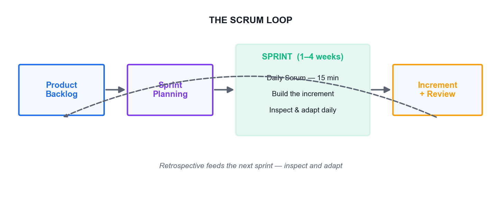

*The Scrum loop — backlog to sprint to increment, with the retrospective feeding the next cycle.*

Scrum is a framework for delivering the highest value in the shortest time through an empirical process built on transparency, inspection and adaptation. It is suited to complex product development where requirements will change.

**What Scrum is not**

- It is not undisciplined. Inspection and adaptation, just-in-time planning and solid engineering practices all take real discipline.
- It is not a detailed Gantt chart plan.
- It is not a silver bullet. Every project differs — stick to the core values and accountabilities when applying it.

**The three accountabilities**

- **Product Owner** — Owns the vision for the product, creates and maintains the Product Backlog, and is the final decision-maker on prioritisation. Owns the WHAT.
- **Scrum Master** — Facilitates the process, builds a self-organising team, removes impediments, protects the team from external disturbance and coaches the practice.
- **Developers** — The cross-functional group who build the increment — design, build, test and everything else needed for a potentially shippable result. They own the HOW.

A team of around seven people, plus or minus two, is the usual guidance. The team is cross-functional, self-organising and self-managing; it plans its own sprint, swarms on tasks to minimise idle work, and communicates face-to-face wherever possible.

### Dual-Track Agile

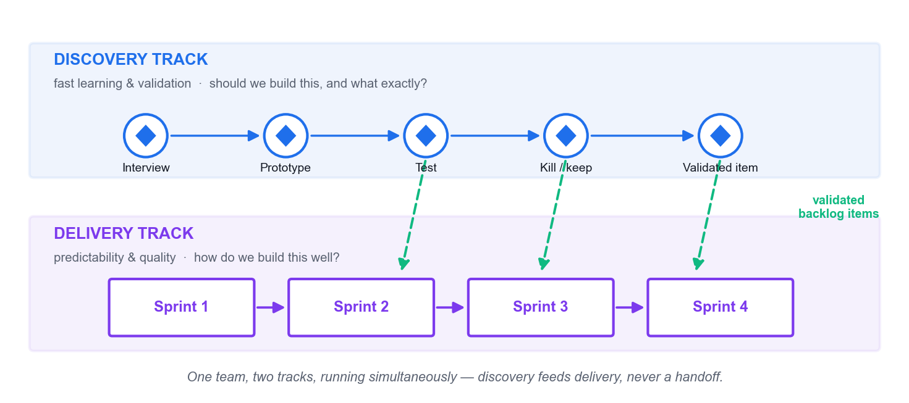

*Dual-track agile — discovery and delivery running simultaneously in one team.*

Dual-track agile was first documented by Desiree Sy in 2007 and popularised by Jeff Patton and Marty Cagan. It runs two tracks at once inside a single team:

- **The discovery track** — Focuses on fast learning and validation. It asks: should we build this, and what exactly? It produces validated product backlog items.
- **The delivery track** — Focuses on predictability and quality. It asks: how do we build this well? It produces releasable increments.

> The most expensive way to test your idea is to build production quality software.

Discovery has three legitimate outcomes: build forward, kill the idea, or keep learning. If you are doing discovery right, you will substantially change and kill a lot of ideas — that is the point, not a failure.

**Four myths about dual-track**

1. 'Discovery comes first, then delivery.' No — both run continuously and simultaneously. Discovery is a necessary part of product development, practised with the same agile and lean principles.
2. 'All work flows from discovery into development.' No — ideas are frequently abandoned during discovery.
3. 'They are separate teams.' No — a product manager, designer and senior engineer may lead discovery, but they must involve the whole team wherever possible.
4. 'Discovery ends at launch.' No — keep measuring and learning after you ship.

> **Note:** The anti-pattern to watch for is what Marty Cagan calls doing little mini-waterfalls inside your Scrum framework: the product manager writes requirements, hands them to a designer who produces wireframes, who hands them to the delivery team. Each handoff looks like collaboration and is actually a queue. The fix is the product manager, designer and lead engineer working together, side by side, to create and validate backlog items.

### Converting Ideas into Agile Artefacts

| Level | What it is | Example |
|---|---|---|
| Epic | A large body of work spanning many sprints | Self-service health screening |
| Feature | A coherent capability within an epic | Appointment booking without a call centre |
| Hill | An outcome statement: as a [who], I want [what], so that [wow] | As a first-time patient, I can book a screening in under 3 minutes, so that I never need to phone. |
| User story | A unit of value: as a [user], I want [goal], so that [reason] | As a patient, I want to see the next three available slots so that I can choose quickly. |
| Task | The work needed to deliver the story | Build the slot-availability API endpoint. |

Hills come from IBM Design Thinking. A Hill states the outcome and the 'wow'; a user story states the function. Teach and use both — they do different jobs. Three Hills per release is the usual guidance, and each must be measurable. In one documented IBM session, a manufacturing user's need for inventory data started as a vague 'in minutes' and was pushed until it became '5 minutes', justified because the data had to be available before the morning manager meeting. That specificity is what separates a testable outcome from an aspiration.

**User stories — the three C's**

- **Card** — The story is written small, on a card. Its size is a deliberate constraint on scope.
- **Conversation** — The card is a promise to have a conversation. The detail lives in that discussion, not in the text.
- **Confirmation** — Acceptance criteria define how you will know it is done — testable conditions, not a restatement of the story.

> **Note:** The most common acceptance-criteria failure, and the one generative AI reproduces most reliably, is criteria that merely repeat the story in other words. If it cannot fail a test, it is not an acceptance criterion.

### Release Prioritisation — The Three-Cake Model

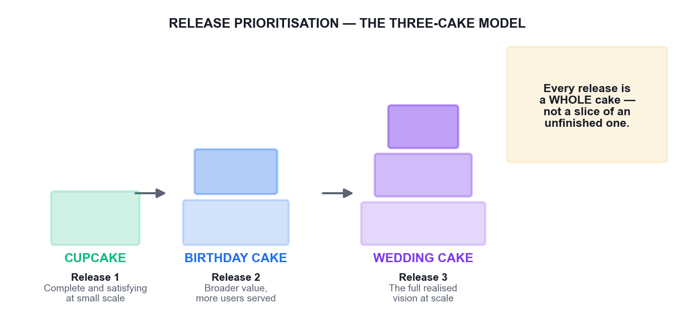

*Cupcake, Birthday Cake, Wedding Cake — every release is a whole cake at its own scale.*

IBM Design Thinking prioritises stories across three releases using an unusually memorable metaphor. The Cupcake release is complete and satisfying at small scale. The Birthday Cake release serves more people with broader value. The Wedding Cake release is the full realised vision.

The point of the metaphor is that a cupcake is a WHOLE cake — not a slice of an unfinished wedding cake. A partially built product is not a smaller product; it is a broken one, and shipping it teaches you nothing except that users dislike broken things. Contrast this with the cost of skipping validation entirely: a builder spends months and thousands of dollars on a handmade steel bookshelf, only to discover the customer bought an e-reader and no longer reads paper books.

### Agile Estimation

- **Size, not duration** — Story points measure relative complexity and effort, not hours. Duration is derived later from observed velocity.
- **Relative, not absolute** — Humans compare well and predict poorly. 'This is twice that' is far more reliable than 'this takes six hours'.
- **A constrained scale** — Values based on the Fibonacci sequence (1, 2, 3, 5, 8, 13, 20, 40, 100) force meaningful distinctions rather than false precision.
- **Additive** — Points can be summed across stories in a way that time-based estimates cannot honestly be.
- **Velocity from done work** — Only fully 'done, done' stories count. Partially completed stories count for nothing — the last 10% routinely takes 90% of the time, and business value is not achieved until it is done.
- **Planning Poker** — Estimate privately, reveal simultaneously, then discuss the outliers. That discussion — not the number — is the real value.

The actual velocity of the last two iterations is the planned velocity of the next. Sizing must account for all the cross-functional effort involved: design, code, test, copywriting, documentation and localisation.

### Ceremonies, Artefacts and Information Radiators

**The daily stand-up**

Fifteen minutes maximum. Each person reports what they did since the last stand-up, what they will do before the next one, and what is blocking them. There is no discussion or debate during the stand-up — listening only. Problem-solving starts after the meeting ends, and the Scrum Master then leads the removal of blockers.

**Artefacts**

- Product Backlog — a broad, prioritised list of all required features and wish-list items, with rough estimates of business value and development effort. It is the WHAT that will be built.
- Sprint Backlog — the prioritised list of stories selected for a given sprint.
- Sprint Burndown Chart — completion of story points over the sprint.
- Release Burndown Chart — progress across a whole release.

**Information radiators**

An information radiator, a term coined by Alistair Cockburn, is a highly visible graphical display of project status in the team's workspace: the current iteration's stories, work assignments, test counts, delivered stories and actions from the previous retrospective. It keeps the team focused and drives transparency across the organisation.

**Retrospective techniques**

- Post-it brainstorming
- Dot voting
- Timeline
- Team radar
- Keep / Drop / Try

### GenAI Across the Sprint

- **Backlog drafting** — Generate candidate stories and acceptance criteria from a Hill in seconds — then cut everything that assumes something you never validated.
- **Backlog grooming** — Flag duplicate and related items across a large backlog faster than any human scan.
- **Test data** — Generate realistic edge-case data sets without exposing real customer records.
- **Retrospective synthesis** — Cluster themes across many notes — after the team has spoken, never instead of it.
- **Sprint reporting** — Draft the summary so the Scrum Master spends the time on impediments rather than formatting.
- **Where it must not run** — Prioritisation, the mid-sprint disruption decision, and the retrospective conversation itself.

---

## Topic 4 — Scaling and Sustaining Innovations with Agile Design Thinking and Generative AI

Topic weighting: 25%. This topic addresses the hardest part: making innovation survive contact with the wider organisation, and proving it worked.

### The Three Levers That Actually Scale Innovation

- **Purpose, alignment and autonomy** — Be stubborn on the vision, but flexible on the details. Teams need a clear outcome and genuine authority to pursue it. Visualising the whole end-to-end process — from aspirations and hypotheses through design experiments to feedback — on a large product wall lets the whole team play along together.
- **Measure things that matter** — Structure your metrics around the future decisions you want to make. Only measure things that indicate progress toward your goal.
- **Make decisions based on learning** — Define beliefs and assumptions so they can be tested, decide the most important thing to learn, then design experiments that deliver that learning.

> If a measurement matters at all, it is because it must have some conceivable effect on decisions and behaviour.

Hypothesis-Driven Development offers a repeatable format for framing outcomes, beliefs and metrics, which makes them easy to communicate to others.

### Culture — The Four Principles

Steve Perkins argues that new practices and methodologies only succeed in a lasting way if the underlying culture supports them. Four principles carry that culture:

1. People over process — assemble people around a shared mission rather than a bureaucratic structure, and prioritise real-time collaboration.
2. Creativity and innovation — allow personal freedom for self-expression, encourage smart risk-taking, and build exploration time into the workflow.
3. Iteration, prototyping and adaptation — replace year-long waterfall-style projects with low-fidelity versions tested in real environments.
4. Multi-disciplinary autonomous teams — self-managing cross-functional teams with genuine local decision-making authority beat hierarchical structures.

**The rollout playbook**

- Run design thinking and agile in PARALLEL, not sequentially.
- Emphasise principles and practices simultaneously.
- Translate concepts into simple, conversational language rather than jargon.
- Reinforce continuously so it does not become the flavour of the month.
- Give specific behavioural examples of what good looks like.
- Celebrate small wins.
- Start small: choose low-risk, high-value opportunities and attempt one to three before scaling.
- Enable cross-functional collaboration, including physical gatherings with real end-users.
- Help agile teams understand the value of the ideation, definition and empathy phases, and allow reframing before development proceeds.

> **Note:** Design thinking requires an organisational culture that is open, trusting and encouraging. Without that foundation the methodology struggles to take root. Teaching design thinking broadly builds valuable awareness, but it does not replace the need for designers with deep expertise, and designers need a seat at the table from the outset.

### Engaging Stakeholders and Creating Buy-In

- Start small and visible — one credible win buys more permission than any presentation.
- Bring evidence, not opinion: the user quote, the test result, and the assumption you falsified.
- Agree the success metric BEFORE the pilot runs, not after the results are in.
- Involve the sceptic early. The person most likely to block it is the most valuable participant in discovery.
- Have leaders participate rather than sponsor. A leader who sits in a user interview changes behaviour more than a memo.
- State what you will stop doing if the evidence goes against you. Naming the downside earns credibility.

### Resource Management in Innovation Projects

- Fund learning rather than plans — release budget in stages tied to validated learning.
- Protect discovery capacity. If discovery is unstaffed, delivery will build whatever is loudest.
- Use AI to free expert time, so scarce expertise goes to judgement work rather than synthesis.
- Track the cost of being wrong, not just the cost of the test. The relevant number is what building the wrong thing would cost.
- Govern AI use: record provenance, check for bias, keep an audit trail for AI-assisted decisions.
- Kill weak work deliberately. Stopping an initiative releases your scarcest resource — your best people.

### Sensemaking

Sensemaking is the discipline of turning ambiguous, conflicting and partial signals into a shared narrative that an organisation can act on. Real innovation decisions are never made on complete evidence.

- Signals arrive incomplete and contested — waiting for certainty is itself a decision.
- The output is a shared narrative the organisation can act on together, not a data dump.
- The evidence that contradicts your narrative is the most valuable input in the room.
- Generative AI clusters signals well, and will confidently manufacture a coherent narrative even when the underlying evidence is thin. Fluency is not truth.

### Systems Thinking

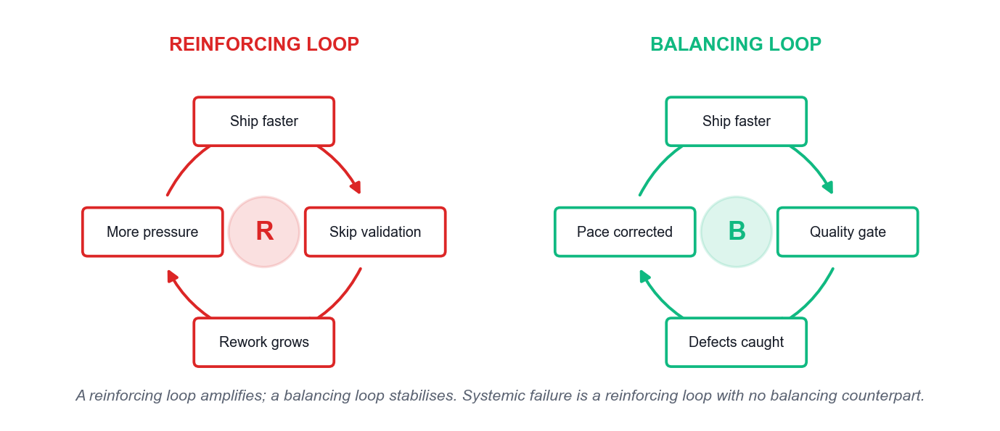

*Reinforcing and balancing feedback loops.*

Systems thinking sees the whole rather than the parts. Five ideas carry most of its practical value:

- **Interconnectedness** — Shift from linear cause-and-effect to circular thinking. A system is a set of components working together to achieve an objective; everything is part of a wider ecosystem.
- **Synthesis** — Combining two or more connections to create a new idea or concept. It is the opposite of analysis, which dissects complexity into parts and loses the behaviour.
- **Emergence** — The natural outcome of things coming together. Emergent behaviour is non-linear and self-organised; it cannot be predicted from the parts alone.
- **Feedback loops** — With connection come loops and flows. Reinforcing loops amplify a change; balancing loops stabilise it. Both are observable and can be altered.
- **Causality** — Understanding how a change in one variable actually propagates to an outcome in a dynamic environment.

Systems mapping draws the elements and their interconnections to reveal insights, guide policy decisions and identify the leverage point where an intervention will actually work.

> **Note:** Systemic failure is typically a reinforcing loop with no effective balancing counterpart. No individual decision in the chain has to be irrational for the outcome to be catastrophic — which is exactly why individual good judgement is not a sufficient safety mechanism.

|  | Design Thinking | Systems Thinking |
|---|---|---|
| Starting point | A human need | A pattern of behaviour over time |
| Unit of attention | The user and their experience | The structure that produces the outcome |
| Asks | What does this person need? | Why does this system keep producing this result? |
| Typical output | A validated solution concept | A leverage point and an intervention |
| Blind spot | Can optimise for one user while harming the system | Can map elegantly and never ship anything |
| Used together | Design the intervention with empathy | Place it where the system will actually respond |

### Metrics and KPIs for Innovation

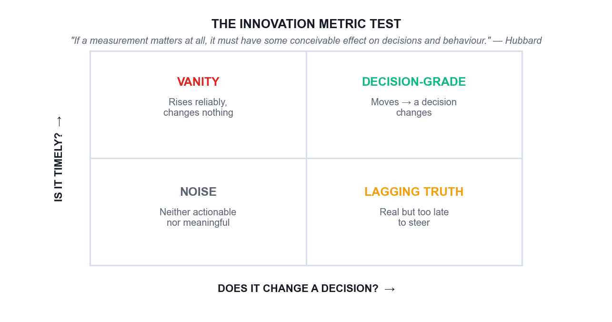

*The innovation metric test — does it change a decision, and is it timely?*

The decisive test for any innovation metric is Hubbard's: if a movement in this number would change no decision that anyone would make, the number is decoration. Vanity metrics — ideas submitted, workshops run, people trained — always rise and prove nothing, which is precisely why they are popular and why they do not survive a budget review.

**A balanced scorecard**

- **Customer value** — Time saved, effort removed, task success rate, or a genuine satisfaction signal.
- **Business value** — Revenue, cost avoided, retention or cycle time, expressed in money where that is honest.
- **Societal value** — Access, inclusion, safety or environmental effect — the value not captured in the price.
- **A leading indicator** — Something that moves early enough to still change a decision this quarter.

**Three separate validations**

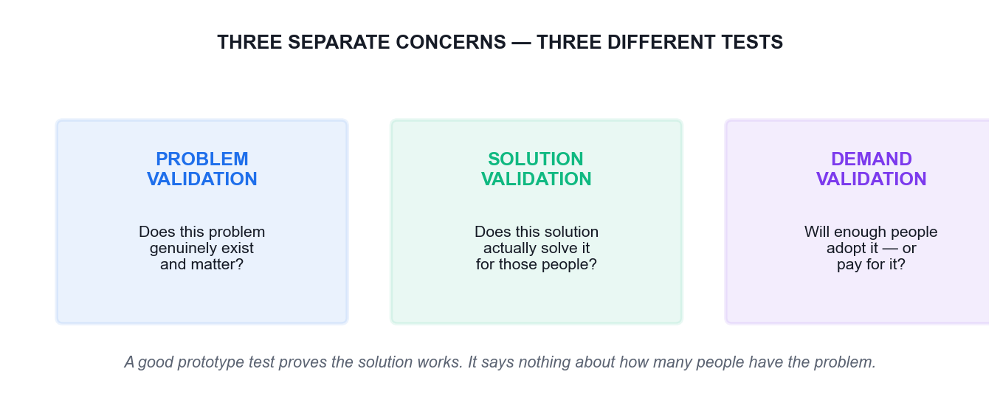

*Problem, solution and demand validation are three different tests.*

Do not conflate a good prototype test result with a strong affinity for the problem, or with customer demand for the solution. These are separate concerns requiring different learning approaches:

- **Problem validation** — Does this problem genuinely exist, and does it matter to enough people?
- **Solution validation** — Does this solution actually solve the problem for those people?
- **Demand validation** — Will they adopt it, switch to it, or pay for it?

> **Note:** Teams routinely present solution-validation evidence as though it proved demand. That is how confidently-built products launch to silence.

---

## Hands-On Activities

The twelve activities below are the practical core of this course. Each is built on a documented real-world case, and each follows the same structure: the case, your scenario, the step-by-step instructions, the discussion questions and the debrief.

Work in groups of three to five. Each activity also exists as a standalone PDF brief in the activities folder, so you can work from a printed copy at your table.

### Activity 1 — Airbnb — Diagnosing Why a Method Alone Does Not Save a Business

Topic 01: Foundations of Design Thinking, Agile, and Generative AI for Problem-Solving   ·   Duration: 45 minutes   ·   Tools: Padlet Classroom Board, ChatGPT or Microsoft Copilot

**Learning outcome addressed**

LO1 · A1 · K1 · K2 — Integrate design thinking methodologies and agile principles to drive organisational innovation.

**The real case**

Airbnb, 2009. The company was weeks from failing, stuck at roughly $200 revenue a week. The founders noticed a pattern in the New York listings: the photographs were terrible, taken on cheap phone cameras in bad light. Rather than run an A/B test or ship a feature, Paul Graham told them to fly to New York and meet the hosts. They rented a camera, went door to door, and replaced the amateur photos with professional ones. Within a week revenue roughly doubled. It was not a scalable act and it was not in any sprint backlog — but it was the insight that unlocked the business, and it later became a funded, scaled service.

**Your scenario**

Your team is the innovation unit of a regional marketplace platform whose bookings have flatlined. Analytics show visitors browse and leave. The engineering team wants to A/B test the checkout button. You suspect, as Airbnb did, that the real problem is not on the screen at all.

**What you will do**

Learners analyse the Airbnb turnaround to separate the three disciplines — Design Thinking (finding the right problem), Lean (validating the solution is worth building) and Agile (building it right) — and explain why starting with Agile alone would never have surfaced the photography insight.

**What you will produce**

A completed Padlet board mapping the Airbnb story onto Design Thinking / Lean / Agile, plus a group position statement on what the marketplace platform should do first.

**Step-by-step instructions**

1. Trainer creates the Padlet classroom and shares the classroom code and QR with the class.
2. Join the Padlet board at https://alfredang.github.io/padlet/ using the classroom code and your display name.
3. Read the Airbnb case in the Learner Guide (Activity 1) with your group of 3–5.
4. In the section 'Right Problem', post what the real problem was and the evidence for it.
5. In the section 'Right Solution', post how the founders validated cheaply before scaling.
6. In the section 'Build It Right', post what Agile delivery would look like once the insight is proven.
7. Use ChatGPT to stress-test your position: paste your problem statement and ask it to argue the opposite case.
8. Post your group's one-sentence recommendation for the marketplace platform, then Like the two strongest posts from other groups.

**Discussion questions**

1. Which of the three disciplines — Design Thinking, Lean or Agile — actually produced the photography insight, and why could the other two not have produced it?
2. The founders did something deliberately unscalable. When is 'do things that don't scale' the right innovation strategy, and when is it an excuse to avoid rigour?
3. Map the story onto the Double Diamond. Where does 'fly to New York and meet the hosts' sit — Discover, Define, Develop or Deliver?
4. Your engineers want to A/B test the checkout button. Write the one question you would ask them to expose whether they are solving the right problem.
5. How would you have used GenAI here — and what part of this story could GenAI NOT have done for you?

**How you know you are done**

Your board shows the story correctly split across all three disciplines, and your recommendation names a discovery action before any build action.

**Debrief — what the room should conclude**

The photography insight came from Empathise, not from analytics. Agile would have optimised the wrong thing faster — a better checkout button on a listing nobody wanted to book. Lean's contribution was the cheap validation (a handful of listings, one week, one rented camera) before any engineering investment. The trap the class should name out loud: teams reach for Agile because it feels productive, and end up building the wrong thing right. GenAI could have clustered the review complaints and drafted interview guides in minutes, but it could not have sat in a host's living room and noticed the light. Empathy is still human work; AI compresses the analysis around it.

---

### Activity 2 — Netflix vs Blockbuster — Innovation as an Operating System

Topic 01: Foundations of Design Thinking, Agile, and Generative AI for Problem-Solving   ·   Duration: 45 minutes   ·   Tools: Padlet Classroom Board, ChatGPT or Microsoft Copilot

**Learning outcome addressed**

LO1 · LO4 · A6 · K2 · K3 — Cultivate design thinking as a viable tool to foster new innovations; drivers of organisational growth.

**The real case**

In 2000 Reed Hastings offered to sell Netflix to Blockbuster for $50 million. Blockbuster's CEO reportedly laughed him out of the room. Blockbuster had 9,000 stores and made a large share of its profit from late fees — a revenue stream that depended on customers being unhappy. Netflix removed late fees entirely, then cannibalised its own profitable DVD-by-mail business to launch streaming in 2007, then cannibalised licensed content by producing originals from 2013. Blockbuster filed for bankruptcy in 2010. Netflix did not win on a single idea; it won because it repeatedly ran the innovation loop against itself while its competitor optimised the business it already had.

**Your scenario**

You lead innovation at an established Singapore firm whose most profitable product line depends on a customer inconvenience — a booking fee, a lock-in contract, or a manual process customers pay to have done for them. A start-up has just launched a free alternative. The board wants a response by the end of the quarter.

**What you will do**

Learners contrast an organisation that treated innovation as a repeatable operating system with one that optimised its existing model, and identify the specific organisational conditions — purpose, autonomy, and what gets measured — that allowed one to self-disrupt and prevented the other.

**What you will produce**

A Padlet comparison board plus a written 'what we would have to stop measuring' statement for the learner's own organisation.

**Step-by-step instructions**

1. Rejoin the Padlet classroom board and open the Activity 2 section.
2. In your group, list every Blockbuster metric you can infer from the case in the sub-section 'What they measured'.
3. Post one metric from your own organisation that quietly protects the status quo.
4. Ask ChatGPT: 'What early signals should a DVD rental chain have tracked in 2000 to detect streaming disruption?' and evaluate whether those signals were knowable then.
5. Post your group's answer to 'what we would have to STOP measuring to innovate honestly'.
6. Comment on another group's post, naming one risk in their proposal.

**Discussion questions**

1. Blockbuster's late fees were both its profit engine and its biggest customer pain point. What is the equivalent in your own organisation?
2. Netflix cannibalised two of its own successful businesses. What made that organisationally possible, and what would block it where you work?
3. 'Measure things that matter' — what was Blockbuster measuring that made the decision to decline look rational at the time?
4. Was Blockbuster's failure a failure of ideas, of execution, or of the operating system around both? Defend your answer.
5. Where could GenAI have given Blockbuster early warning, and would leadership have believed it?

**How you know you are done**

Your board names at least one real metric in your own organisation that discourages innovation, and one concrete change to it.

**Debrief — what the room should conclude**

Blockbuster did not lack information — it lacked an operating system that let unwelcome information change a decision. Its metrics rewarded protecting late-fee revenue, so every rational manager defended it. This is the 'measure things that matter' principle in its negative form: a metric that cannot change a decision is decoration, and a metric that punishes the future protects the past. Netflix's advantage was structural, not creative: purpose and autonomy at the top, cheap experiments underneath, and a willingness to let a new bet eat an old one. GenAI would have flagged the trend, but the barrier was never detection — it was the incentive to act.

---

### Activity 3 — Positioning GenAI in the Innovation Loop — Where It Helps and Where It Lies

Topic 01: Foundations of Design Thinking, Agile, and Generative AI for Problem-Solving   ·   Duration: 40 minutes   ·   Tools: ChatGPT or Microsoft Copilot, Padlet Classroom Board

**Learning outcome addressed**

LO1 · K1 — Latest trends in design thinking; how generative AI enhances design thinking and agile processes.

**The real case**

A Singapore bank's innovation team used a large language model to generate customer personas for a new savings product aimed at gig-economy workers. The AI produced five polished, confident personas in under a minute, complete with names, incomes, quotes and frustrations. The team built a concept around 'Marcus, 29, a Grab driver saving for a HDB flat'. When they finally ran six real interviews, the actual gig workers' dominant anxiety was not saving for a flat at all — it was irregular income smoothing within a single month, and a deep distrust of anything that locked their money away. The AI personas were plausible, internally consistent, well-written, and wrong. They were a compression of what the internet says about gig workers, not evidence about these gig workers.

**Your scenario**

Your team has two weeks to produce a validated problem statement. A colleague proposes skipping the interviews because 'the AI personas are good enough and we're behind schedule'.

**What you will do**

Learners run the same persona-generation task through a GenAI tool, then interrogate the output against an evidence test, to build a working rule for where GenAI belongs in the design thinking loop and where its confident fluency becomes a liability.

**What you will produce**

A GenAI-generated persona set annotated with evidence gaps, and a group 'AI use rule' posted to Padlet.

**Step-by-step instructions**

1. Open ChatGPT or Microsoft Copilot.
2. Prompt: 'Create 3 detailed user personas for a savings product aimed at gig-economy workers in Singapore. Include name, age, income pattern, goals, frustrations and a representative quote.'
3. Read the output as a group and mark every claim that is an assumption rather than evidence.
4. Prompt the AI again: 'For each persona, list what evidence would be required to confirm it, and what would falsify it.'
5. Compare the two outputs — note how much more useful the second framing is.
6. Draft your group's one-sentence rule for using GenAI in discovery and post it to the Padlet Activity 3 section.
7. Like the rule you find most defensible from another group and comment why.

**Discussion questions**

1. The AI personas were plausible but wrong. What property of large language models makes fluent output a poor proxy for truth?
2. Which parts of the design thinking loop can GenAI genuinely accelerate, and which parts must stay human? Draw the line and justify it.
3. Your colleague says the interviews can be skipped. Give the strongest version of their argument, then rebut it.
4. How would you make an AI-generated persona falsifiable — what evidence would prove it wrong?
5. What governance would you put in place so AI-generated insight is always labelled as unvalidated?

**How you know you are done**

Your annotated persona set clearly separates assumption from evidence, and your posted rule states both where GenAI is allowed and where it is not.

**Debrief — what the room should conclude**

A language model generates the statistically likely, not the locally true. That is exactly what you want for divergence — volume, range, provocations, first drafts — and exactly what you must not trust for convergence, where a wrong-but-confident persona sends a whole quarter's work in the wrong direction. The workable rule most groups arrive at: use GenAI to widen the funnel and to synthesise evidence you already collected; never use it as the evidence itself. Practically, every AI-generated artefact should carry a provenance label — who or what produced it, and what real-world evidence has since confirmed or refuted it. Note also the failure was caught only because someone eventually talked to six real people; six interviews is a small price for not building the wrong product.

---

### Activity 4 — GE Adventure Series — Reframing the Problem Instead of Fixing the Machine

Topic 02: Problem Framing and Ideation: Leveraging Design Thinking and Generative AI   ·   Duration: 50 minutes   ·   Tools: Design Thinking Studio, ChatGPT or Microsoft Copilot

**Learning outcome addressed**

LO2 · A3 · A5 — Synthesise information from different sources and stakeholders to fully understand end-user needs.

**The real case**

GE Healthcare's MRI scanners were technically excellent, but designer Doug Dietz watched a small child cry with terror in front of one of his own machines. He learned that up to 80% of paediatric patients had to be sedated to complete a scan — which meant an anaesthetist on standby, longer slots, higher cost and real clinical risk. The engineering brief would have been 'make the scanner quieter and faster'. Dietz reframed it: the problem was not the machine's noise, it was a terrifying experience for a frightened child. The team painted the scanner rooms as pirate ships, jungles and space adventures, and trained operators to narrate the scan as an adventure — 'hold very still while the ship goes through the asteroid field'. Sedation rates for paediatric patients dropped dramatically (reported as low as around 10% in redesigned suites), patient satisfaction rose sharply, and throughput improved. Not one component of the scanner's imaging technology was changed.

**Your scenario**

You work for a Singapore polyclinic group. Elderly patients frequently miss or abandon their health screening appointments. The operations team's proposed solution is an SMS reminder system with a confirm button. Screening uptake has not moved in two years despite three reminder revamps.

**What you will do**

Learners practise the reframing move that turns a technical brief into a human one: building an empathy map from the case, extracting a Point of View statement, and generating How Might We questions at the right altitude — neither so broad they are useless nor so narrow they smuggle in the solution.

**What you will produce**

A completed Empathize and Define stage in the Design Thinking Studio: empathy map, POV statement and a voted set of How Might We questions for the polyclinic scenario.

**Step-by-step instructions**

1. Trainer clicks Create New Workspace at https://alfredang.github.io/designthinking/ and shares the workspace code or QR.
2. Click Join Workspace, enter the code and your display name.
3. Open the Empathize stage. In Empathy Map, post to Says, Thinks, Does and Feels for an elderly patient who skipped a screening.
4. Post at least two entries into User Pain Points that are NOT about forgetting the appointment.
5. Move to the Define stage. In Problem Statement, write a POV: '[User] needs [need] because [insight]'.
6. In How Might We Questions, post three HMW questions at different altitudes.
7. Use ChatGPT to generate five more HMW variants, then post only the ones that pass the altitude test.
8. Vote on the HMW questions using the voting control; the top-voted question carries into Activity 5.

**Discussion questions**

1. The engineering brief was 'make the scanner quieter'. Dietz's brief was different. State both as problem statements and explain what the reframe unlocked.
2. GE changed the experience, not the technology. In the polyclinic scenario, what is the 'paint the scanner' equivalent — and what is the 'make it quieter' trap?
3. Write a How Might We that is too broad, one that is too narrow, and one that is just right. What makes the third one workable?
4. Whose perspective is missing from an empathy map built only from the operations team's data?
5. Sedation rate was the number that proved the redesign worked. What single number would prove your polyclinic solution worked?

**How you know you are done**

Your Define stage holds a POV statement traceable to a specific empathy-map entry, and a top-voted HMW question that neither names a solution nor is too vague to answer.

**Debrief — what the room should conclude**

Reframing is the highest-leverage move in design thinking and the one teams skip under deadline pressure. 'Make the scanner quieter' produces an incrementally better scanner; 'how might we make a frightened seven-year-old feel brave' produces a pirate ship. Note what did not change: the imaging hardware, the physics, the budget for a new machine. The constraint was the same; the problem statement was different. The altitude test for a How Might We question: if there is only one obvious answer it is too narrow (the solution is hiding inside the question); if you cannot imagine any concrete answer it is too broad. For the polyclinic, the reminder-system framing assumes the barrier is forgetting. If the real barrier is fear of a bad result, fear of cost, or having nobody to accompany them, no reminder will ever fix it — and two years of flat uptake is the evidence.

---

### Activity 5 — IDEO Shopping Cart — Volume, Then Judgement

Topic 02: Problem Framing and Ideation: Leveraging Design Thinking and Generative AI   ·   Duration: 50 minutes   ·   Tools: Design Thinking Studio, ChatGPT or Microsoft Copilot

**Learning outcome addressed**

LO2 · LO4 · A3 — Ideation and brainstorming techniques enhanced by generative AI.

**The real case**

In 1999, ABC's Nightline gave the design firm IDEO five days to redesign the supermarket shopping cart on camera. The team did not start by designing. They went out and observed shoppers, interviewed store managers about theft and maintenance, and talked to a child-safety expert. They then ran structured brainstorms under explicit rules — defer judgement, encourage wild ideas, build on the ideas of others, go for quantity, stay focused, one conversation at a time, be visual — and generated a large volume of concepts before converging. The result was a modular cart with detachable hand baskets, a child seat designed for safety, and a scanning system that skipped the checkout queue. Crucially it was never meant for mass production; it was a provocation that demonstrated the process. The famous rule from that studio: separate idea generation from idea evaluation, because judging while generating kills the unusual ideas first.

**Your scenario**

Carry forward the top-voted How Might We question from Activity 4. Your team has 25 minutes to generate and converge on ideas for the polyclinic screening challenge, with a GenAI tool available as an idea multiplier.

**What you will do**

Learners run a disciplined divergence–convergence cycle using Crazy 8s and structured brainstorming, amplify it with GenAI, then converge with dot voting — experiencing directly why mixing generation and evaluation suppresses the best ideas.

**What you will produce**

A populated Ideate stage — brainstorming board, Crazy 8s, categorised ideas and a voted shortlist of three concepts to prototype.

**Step-by-step instructions**

1. Open the Ideate stage in the Design Thinking Studio workspace.
2. Round 1 — silent, manual. Each person posts at least four ideas into Brainstorming Board. No discussion, no judging.
3. Round 2 — Crazy 8s. Eight rapid variations on the most promising idea, posted into Crazy 8s Ideas.
4. Round 3 — AI amplification. Prompt: 'Give 15 diverse solution concepts for [your HMW question], including 3 deliberately unconventional ones.'
5. Post only the AI ideas that add something your group did not already have.
6. Group everything into themes using Idea Categories.
7. Dot vote in Voting & Prioritisation and shortlist the top three concepts.
8. Record in the workspace which of the three shortlisted ideas came from a human and which from the AI.

**Discussion questions**

1. IDEO's rules include 'defer judgement' and 'encourage wild ideas'. What actually happens in a meeting when these are not enforced?
2. You generated ideas manually, then with AI. Compare the two sets — which was more diverse, and which was more useful?
3. The cart was never mass-produced. What is the value of a prototype that was never meant to ship?
4. Under what conditions does GenAI reduce the diversity of ideas in a room instead of increasing it?
5. Who should have the final vote on which idea proceeds — and what does that choice say about your organisation?

**How you know you are done**

Your Ideate stage shows a clear divergence phase and a separate convergence phase, with three shortlisted concepts and their provenance recorded.

**Debrief — what the room should conclude**

Two effects usually show up in the room. First, the manual round produces fewer ideas but more surprising ones, because they come from lived context the model does not have; the AI round produces more ideas but they cluster around the conventional centre of the training distribution. The productive pattern is manual-first, then AI to extend — running AI first anchors everyone to its framing and measurably narrows the room. Second, groups that skip the 'defer judgement' rule converge far too early on the safe idea. The IDEO cart matters precisely because it was never shipped: a prototype's job is to make an idea arguable and testable, not to be the final answer. Dot voting is not democracy for its own sake — it surfaces which ideas the group can actually rally behind before anyone spends money.

---

### Activity 6 — Rapid Prototyping with AI — From Concept to Testable Artefact in One Hour

Topic 02: Problem Framing and Ideation: Leveraging Design Thinking and Generative AI   ·   Duration: 50 minutes   ·   Tools: Design Thinking Studio, ChatGPT or Microsoft Copilot, Adobe Firefly (optional)

**Learning outcome addressed**

LO2 · LO4 · A4 — Prototyping with AI-driven tools: rapid development and feedback.

**The real case**

A hospital innovation team in Singapore needed to test whether a self-service kiosk would reduce queue times at a specialist outpatient clinic. The traditional route — a scoped software build — would have taken a quarter and a budget approval. Instead the team used a GenAI tool to draft the screen copy and flow, printed the screens on paper, and ran a 'Wizard of Oz' test in the clinic corridor: a staff member sat behind a curtain and swapped the paper screens by hand while real patients used it. Within two days they learned that elderly patients did not fail at the touchscreen — they abandoned at the point where the kiosk asked for an NRIC, because they were not sure whether it was safe to enter it in public view. That single insight redirected the entire design, and it cost nothing but paper and two afternoons. Had they built the software first, they would have discovered it after the budget was spent.

**Your scenario**

Take the top-voted concept from Activity 5. You have 50 minutes to make it testable by a real person — not to build it.

**What you will do**

Learners use GenAI to draft prototype content and user flows, assemble a low-fidelity prototype, and define an explicit test plan with falsifiable assumptions — practising 'build to think' rather than 'build to ship'.

**What you will produce**

A low-fidelity prototype (paper, slide or wireframe) with a written test plan, listed assumptions and the criteria that would prove the concept wrong.

**Step-by-step instructions**

1. Open the Prototype stage in the Design Thinking Studio workspace.
2. Post your concept in one paragraph into Prototype Description.
3. Prompt the AI: 'Draft the user flow and screen-by-screen copy for [your concept]. Flag the three steps most likely to cause drop-off.'
4. Post the flow into User Flow and the key screens into Screens / Wireframes.
5. List every assumption your concept depends on in Assumptions — be ruthless.
6. Optionally use Adobe Firefly to generate a visual for the concept.
7. Move to the Test stage and write a Test Plan: who you would test with, the task you would set, and what result would prove you wrong.
8. Swap workspaces with another group, run their prototype as a user, and post honest feedback into their User Feedback section.

**Discussion questions**

1. The kiosk team learned the real barrier was privacy, not usability. Which of your assumptions, if wrong, would sink your concept fastest?
2. What is the cheapest possible artefact that would still generate a real reaction from a real user?
3. 'Build to think, not to ship.' What is the risk of a prototype that looks too polished?
4. Where did GenAI genuinely save time here, and where would relying on it have hidden the privacy insight?
5. Write the one question you would ask a test user that could prove your concept wrong.

**How you know you are done**

Your prototype can be run by someone from another group without you explaining it, and your test plan states in advance what result would falsify the concept.

**Debrief — what the room should conclude**

A prototype's purpose is to buy information at the lowest possible price. The kiosk team bought a quarter's worth of learning for two afternoons and a stack of paper. Note the specific trap in polished prototypes: when an artefact looks finished, test users critique surface details and politely withhold fundamental objections — a rough paper screen invites honest reaction in a way a clean mockup does not. GenAI is genuinely excellent at the drafting layer here: screen copy, flow logic, edge cases, even the interview script. What it cannot do is stand in the corridor and watch a 74-year-old hesitate over her NRIC. Every prototype should ship with its falsification criteria written down in advance; a test you cannot fail is a demonstration, not a test.

---

### Activity 7 — Spotify — Reading a Scaling Model Honestly

Topic 03: Agile Development and AI for Rapid Solution Delivery   ·   Duration: 45 minutes   ·   Tools: Padlet Classroom Board, ChatGPT or Microsoft Copilot

**Learning outcome addressed**

LO3 · A7 · K5 — Agile frameworks for managing innovation projects; project management tools and techniques.

**The real case**

In 2012 Henrik Kniberg and Anders Ivarsson published a paper describing how Spotify organised engineering into Squads, Tribes, Chapters and Guilds. It spread worldwide as 'the Spotify Model' and was copied by hundreds of organisations. What most of those organisations missed was the disclaimer in the paper itself: it was a snapshot of a journey, not a framework, and Spotify had already moved on. Kniberg later stated plainly that Spotify does not use 'the Spotify Model' and that people should not copy it. Organisations that copied the structure — renaming teams 'squads' and departments 'tribes' — routinely failed to copy the culture of trust and autonomy that made it work, and ended up with the same hierarchy under new labels. The lesson: practices without principles are a short-lived Band-Aid.

**Your scenario**

Your management team has returned from a conference and wants to 'implement the Spotify Model' across three departments by the end of the quarter. You have been asked to write the implementation plan.

**What you will do**

Learners examine the most-copied agile scaling model in the industry and diagnose why structural copying fails, then distinguish the transferable principles from the non-transferable artefacts — the core skill in leading design thinking and agile projects across an organisation.

**What you will produce**

A Padlet board separating Spotify's transferable principles from its non-transferable structures, and a one-page counter-proposal to the 'implement it by Q4' instruction.

**Step-by-step instructions**

1. Rejoin the Padlet classroom board and open the Activity 7 section.
2. Read the Spotify case in the Learner Guide (Activity 7) with your group.
3. In the sub-section 'Structures', post the parts of the model that are organisational artefacts.
4. In the sub-section 'Principles', post the underlying beliefs that made those artefacts work.
5. Ask ChatGPT: 'What conditions must be true in an organisation for autonomous squads to outperform a functional hierarchy?' and evaluate its answer critically.
6. Draft your counter-proposal: one team, one quarter, one measurable outcome. Post it.
7. Read another group's counter-proposal and comment with the biggest risk you see in it.

**Discussion questions**

1. Spotify's own authors say do not copy it. Why did hundreds of organisations copy it anyway?
2. Separate the list: which parts of the model are structures (copyable) and which are cultures (not directly copyable)?
3. 'Practices without principles are a short-lived Band-Aid. And principles without practices are a fruitless exercise in philosophy.' Give a workplace example of each failure mode.
4. Your management wants it done by Q4. Write the one question that reframes the request without being insubordinate.
5. How might GenAI help you assess organisational readiness before a rollout — and what would it get wrong?

**How you know you are done**

Your board cleanly separates structure from principle, and your counter-proposal names one team, one outcome and one metric rather than an organisation-wide rollout.

**Debrief — what the room should conclude**

Renaming a department a 'tribe' changes nothing; devolving budget authority to it changes everything. The copyable parts are the visible artefacts — squad names, chapter structures, guild meetings. The parts that actually generated the results are autonomy backed by real decision rights, alignment through a clear mission, and a tolerance for teams choosing different practices. Those cannot be installed by reorganisation chart. The professional move when handed 'implement it by Q4' is not refusal but reframing: ask what outcome the leadership team actually wants — faster delivery, better retention, fewer handoffs — and then propose the smallest change that could plausibly move it, run in one team first. PremierAgile's guidance applies directly: start small, low-risk and high-value, one to three attempts before scaling.

---

### Activity 8 — From Hills to Backlog — Converting Ideas into Stories with GenAI

Topic 03: Agile Development and AI for Rapid Solution Delivery   ·   Duration: 55 minutes   ·   Tools: Design Thinking Studio, Padlet Classroom Board, ChatGPT or Microsoft Copilot

**Learning outcome addressed**

LO3 · LO4 · K5 — Converting ideas into agile features, stories and tasks with GenAI; project management tools and techniques.

**The real case**

IBM runs a two-day Design Thinking and Agile workshop in which Day 1 produces 'Hills' — outcome statements in the form 'As a [who], I want [what], so that [wow]' — and Day 2 converts them into 20–30 user stories, prioritises them into three releases and sizes them with Planning Poker. In one documented session, a manufacturing user's need for inventory data started as a vague 'in minutes'. The team pushed until it became '5 minutes', and the justification made the requirement real: the data had to be available before the morning manager meeting. That specificity is what separates an outcome you can test from an aspiration you cannot. IBM prioritises releases as 'Cupcake, Birthday Cake, Wedding Cake' — where the cupcake is a complete, satisfying cake at small scale, not a slice of an unfinished one.

**Your scenario**

Take the prototype concept your group validated in Activity 6. Your product trio — product manager, designer, engineer — now has one hour to turn it into a release-one backlog that a delivery team could actually start on Monday.

**What you will do**

Learners write a measurable Hill, use GenAI to expand it into user stories with acceptance criteria, critique and correct the AI output, prioritise into the three-cake release model and size the stories with relative estimation.

**What you will produce**

A prioritised release-one backlog: one Hill, 8–12 user stories with acceptance criteria, a Cupcake/Birthday/Wedding split and story-point estimates.

**Step-by-step instructions**

1. Open the Padlet classroom board, Activity 8 section.
2. Write ONE Hill for your concept: 'As a [who], I want [what], so that [wow]'. Make the wow measurable.
3. Post the Hill and have another group challenge its measurability. Revise it.
4. Prompt the AI: 'Convert this Hill into 10 user stories in the form As a/I want/so that, each with 2-3 testable acceptance criteria.'
5. Review every story. Delete the ones that assume something you never validated. Rewrite the weak acceptance criteria.
6. Split the surviving stories into Cupcake, Birthday Cake and Wedding Cake releases.
7. Size the Cupcake stories using relative points (1, 2, 3, 5, 8) — discuss any estimate where the group differs by more than two cards.
8. Post your final release-one backlog to Padlet and Like the backlog you would most want to inherit as a developer.

**Discussion questions**

1. Compare a Hill ('so that [wow]') with a user story ('so that [reason]'). What does the Hill capture that the story loses?
2. The team pushed 'in minutes' to '5 minutes'. What forced the specificity, and what would have happened without it?
3. Review the AI-generated stories. What did it get structurally right, and what did it get wrong about your context?
4. Explain 'Cupcake' to someone who thinks an MVP is 'version one with features removed'. Where is the difference?
5. Story points measure size and complexity, not duration. Why does the distinction matter for a team's velocity?

**How you know you are done**

Your Cupcake release is genuinely shippable and useful on its own, every story has testable acceptance criteria, and you can point to which stories you deleted from the AI output and say why.

**Debrief — what the room should conclude**

GenAI is genuinely good at the mechanical layer of this task — it produces well-formed stories with plausible acceptance criteria in seconds, and it rarely forgets the syntax. What it cannot supply is context: your constraints, your regulatory environment, your legacy integration, your users' actual tolerance for change. The reliable pattern is AI drafts, humans decide. Watch for the two characteristic AI failures in the room: stories that are technically well-formed but describe features nobody validated, and acceptance criteria that restate the story instead of defining a testable condition. On the cake model — the point of the cupcake is that a person could genuinely enjoy it and it stands alone. A slice of unfinished wedding cake is not a smaller product, it is a broken one, and shipping it teaches you nothing except that users dislike broken things.

---

### Activity 9 — Running Dual-Track Agile — A Sprint Simulation with AI Assistance

Topic 03: Agile Development and AI for Rapid Solution Delivery   ·   Duration: 50 minutes   ·   Tools: Padlet Classroom Board, Design Thinking Studio, ChatGPT or Microsoft Copilot

**Learning outcome addressed**

LO3 · LO1 · A7 · K5 — Using generative AI for faster iterations and feedback in agile sprints; lead design thinking projects.

**The real case**

Marty Cagan describes the most common failure he sees in teams that believe they are agile: 'many people essentially doing little mini-waterfalls within their Scrum framework' — the product manager writes requirements, hands them to a designer who produces annotated wireframes, who hands them to a delivery team to build and test. Each handoff looks like collaboration and is actually a queue. The dual-track alternative runs discovery and delivery simultaneously in one team: the product trio continuously validates ideas cheaply while the delivery track builds the already-validated ones. Jeff Patton's line is the justification: 'The most expensive way to test your idea is to build production quality software.' Discovery's job is to kill ideas cheaply — 'if we're doing discovery right, we substantially change and kill lots of ideas.'

**Your scenario**

Your team is running Sprint 1 on the Cupcake release from Activity 8. Mid-sprint, a stakeholder arrives with an urgent new request and a competitor announcement. You must decide what happens to the sprint, the backlog and the discovery track.

**What you will do**

Learners simulate a compressed sprint — planning, a daily stand-up, a mid-sprint disruption, a review and a retrospective — running a discovery track in parallel, and use GenAI to accelerate the administrative parts of the ceremonies without surrendering the decisions.

**What you will produce**

A completed sprint simulation record: sprint goal, committed backlog, stand-up notes, a documented disruption decision, review outcome and an AI-assisted retrospective with three actions.

**Step-by-step instructions**

1. Assign roles in your group: Product Owner, Scrum Master, and 2-3 Developers.
2. Sprint Planning — agree a one-sentence sprint goal and pull Cupcake stories that fit. Post to Padlet.
3. Run a 3-minute stand-up: each person states progress, next step and blockers.
4. The trainer introduces the mid-sprint disruption. Decide as a team: absorb, defer, or swap. Document the decision AND the reasoning.
5. In parallel, run the discovery track — open the Test stage in the Design Thinking Studio and log what you would validate before the new request enters a sprint.
6. Sprint Review — present your Cupcake increment to another group acting as stakeholders and capture their feedback.
7. Retrospective — each person posts one Keep, one Drop, one Try. Then ask the AI to cluster the themes.
8. Compare the AI's clustering with your own reading of the room, and agree three concrete actions.

**Discussion questions**

1. A stakeholder interrupts mid-sprint. What are your options, and what does each one cost in trust, focus and delivery?
2. Cagan calls handoffs 'little mini-waterfalls'. Where do handoffs disguised as collaboration happen in your organisation?
3. Discovery's job is partly to kill ideas. Why is killing an idea a success, and why do organisations rarely reward it?
4. Which ceremony did GenAI genuinely improve, and which one would it damage if you let it run unsupervised?
5. Your velocity drops because the team spent time on discovery. How do you explain that to a manager who only tracks delivery?

**How you know you are done**

Your sprint record shows a protected sprint goal, a documented and justified disruption decision, and three retrospective actions with named owners.

**Debrief — what the room should conclude**

The disruption is the real lesson. Teams that protect the sprint goal and route the new request into the discovery track keep both their focus and their responsiveness; teams that swap scope mid-sprint lose the sprint and teach stakeholders that interrupting works. Note the asymmetry — the request does not have to wait long, it just has to be validated before it displaces committed work. On AI in ceremonies: it is excellent at summarising stand-up notes, clustering retrospective themes and drafting the sprint report, and it is actively harmful if it runs the retrospective itself, because the value of a retrospective is the team saying uncomfortable things to each other, not a tidy summary. Watch for velocity anxiety: a team doing genuine discovery will show lower delivery velocity and higher decision quality, which is only a problem if the organisation measures the wrong one.

---

### Activity 10 — DBS Bank — Scaling Innovation Across 25,000 People

Topic 04: Scaling and Sustaining Innovations with Agile Design Thinking and Generative AI   ·   Duration: 50 minutes   ·   Tools: Padlet Classroom Board, ChatGPT or Microsoft Copilot

**Learning outcome addressed**

LO4 · A2 · A6 · K2 · K3 — Develop strategies to proliferate design thinking across the organisation; drivers of organisational growth.

**The real case**

Around 2014 DBS Bank set out to 'Make Banking Joyful' and to become a technology company delivering banking. Rather than launching an innovation lab and hoping it spread, DBS changed the operating system: it ran large-scale hackathons pairing bankers with start-ups, trained thousands of staff in customer journey thinking, moved the majority of its technology in-house from outsourced vendors, and adopted the discipline of measuring customer time saved — reporting tens of millions of customer hours eliminated from waiting and rework. Senior leaders were required to participate, not merely sponsor. DBS was subsequently named the world's best bank by multiple international publications. The instructive part is not the awards but the mechanism: DBS changed what got measured, who had authority, and what leaders personally did — and let the culture follow.

**Your scenario**

You have run one successful design thinking pilot in your department. Your director is impressed and asks you to 'roll it out to the whole division' — 400 people — with no additional budget and no change to existing KPIs.

**What you will do**

Learners analyse how a large regulated organisation actually scaled human-centred innovation, and build a realistic scaling plan that changes measurement, authority and leadership behaviour rather than merely running more training.

**What you will produce**

A one-page scaling plan for the learner's own organisation covering the first 90 days, the metric that would change, and the leadership behaviour required.

**Step-by-step instructions**

1. Rejoin the Padlet classroom board, Activity 10 section.
2. Read the DBS case in the Learner Guide (Activity 10) with your group.
3. Post the three mechanisms DBS used that were NOT training.
4. For your own organisation, post one metric you would change and what behaviour that change would trigger.
5. Ask ChatGPT: 'What are the most common failure modes when scaling design thinking in a large regulated organisation?' Evaluate its list against the DBS case.
6. Draft your 90-day scaling plan: scope, metric, leadership behaviour, first team.
7. Post it and comment on another group's plan, naming the assumption most likely to break.

**Discussion questions**

1. DBS measured 'customer hours saved'. Why is that a more powerful scaling lever than counting how many staff attended training?
2. Your director offers no budget and no KPI change. What is the honest risk to the rollout, and how do you surface it professionally?
3. DBS required leaders to participate rather than sponsor. What is the practical difference, and which does your organisation do?
4. Which is harder to scale — the method, the mindset, or the authority to act on what you learn? Defend your ranking.
5. Where would GenAI genuinely accelerate a 400-person rollout, and where would it create the illusion of progress?

**How you know you are done**

Your plan changes at least one measurement and one authority, not just the training calendar, and its scope is small enough to be real.

**Debrief — what the room should conclude**

Training 400 people produces 400 people who know the vocabulary and cannot use it, unless three other things change: what gets measured, who is allowed to decide, and what senior leaders visibly do. DBS's customer-hours-saved metric is instructive because it is a customer-value measure that the whole organisation could act on, unlike a training-completion count, which measures activity and changes nothing. The honest answer to the no-budget no-KPI-change instruction is that the rollout will produce awareness without behaviour — and the professional way to say so is to propose a smaller scope with a real metric attached rather than to accept an unachievable one. GenAI can genuinely help with scale here: producing training material, synthesising feedback from 400 people, spotting where teams are stuck. It cannot manufacture the authority that makes the method usable.

---

### Activity 11 — Boeing 737 MAX — Systems Thinking and the Cost of Local Optimisation

Topic 04: Scaling and Sustaining Innovations with Agile Design Thinking and Generative AI   ·   Duration: 50 minutes   ·   Tools: Design Thinking Studio, Padlet Classroom Board, ChatGPT or Microsoft Copilot

**Learning outcome addressed**

LO4 · K2 · K4 — Systems thinking, feedback loops and causality; concept and principles of resource management.

**The real case**

Boeing needed a competitive response to the Airbus A320neo quickly and cheaply. Fitting larger, more efficient engines to the existing 737 airframe changed the aircraft's pitch behaviour, so Boeing added MCAS, a software system that automatically pushed the nose down. Each decision was locally rational: reuse the airframe to save cost and time; solve the aerodynamic consequence in software; keep the aircraft under the same type rating so airlines would not need expensive pilot simulator training; therefore minimise what pilots were told about MCAS. Two crashes killed 346 people and the fleet was grounded worldwide for around 20 months. No single decision was insane in isolation. The system of decisions — commercial pressure, a reused airframe, a software patch, and a training omission driven by the commercial goal — was lethal. This is what a reinforcing feedback loop with no effective balancing loop looks like in practice.

**Your scenario**

Your organisation is under pressure to ship an AI-assisted feature before a competitor. Each team is optimising its own deliverable. You have been asked to review the programme for systemic risk.

**What you will do**

Learners map a real systemic failure using interconnectedness, feedback loops and causality, then apply the same mapping to an AI-driven innovation programme to identify where local optimisation is producing global risk.

**What you will produce**

A causal loop map of the 737 MAX decision chain, and a systemic risk register for the learner's own AI-assisted programme.

**Step-by-step instructions**

1. Open the Padlet classroom board, Activity 11 section.
2. Read the 737 MAX case in the Learner Guide (Activity 11).
3. On paper or in the workspace, draw the decision chain as a loop: each node is a decision, each arrow is 'made necessary'.
4. Mark on your loop the single point where a balancing mechanism would have had the most leverage.
5. Post a photo or description of your loop to Padlet.
6. Now map YOUR AI-assisted programme the same way. Identify one reinforcing loop with no balancing counterpart.
7. Ask ChatGPT to argue why your proposed balancing mechanism would be resisted, and prepare your response.
8. Post your systemic risk register entry: the loop, the leverage point, the mechanism, and who has authority to trigger it.

**Discussion questions**

1. Trace the chain: which decision made the next one seem necessary? Where could one balancing loop have broken it?
2. Every decision was locally rational. What does that tell you about relying on individual good judgement as a safety mechanism?
3. Who in the system had the information to see the whole picture, and what stopped that information from changing the outcome?
4. Apply the same analysis to an AI-driven innovation programme. Where does speed pressure create a comparable blind spot?
5. What is the systems-thinking equivalent of 'the scanner is too loud' — the local fix that hides the real problem?

**How you know you are done**

Your loop map shows causality rather than a timeline, and your risk register names a mechanism with a named owner who has authority to stop work.

**Debrief — what the room should conclude**

Systems thinking is not an abstract philosophy; it is the discipline that catches failures no individual decision-maker can see. The 737 MAX chain is a textbook reinforcing loop: commercial urgency drove airframe reuse, which drove the software fix, which drove the training omission, each step justified by the previous one, with no balancing loop strong enough to interrupt it. Note who could have interrupted it — regulators, test pilots, engineers — and what neutralised them: delegated certification, schedule pressure, and a framing in which raising the concern meant arguing against the commercial case. For AI programmes the parallel is direct. Speed pressure produces a model shipped without evaluation, then a guardrail bolted on, then a monitoring gap because monitoring would slow the launch. The countermeasure is structural, not attitudinal: a named balancing mechanism with the authority to stop the line.

---

### Activity 12 — Innovation Metrics — Designing KPIs That Change a Decision

Topic 04: Scaling and Sustaining Innovations with Agile Design Thinking and Generative AI   ·   Duration: 45 minutes   ·   Tools: Padlet Classroom Board, ChatGPT or Microsoft Copilot

**Learning outcome addressed**

LO4 · A4 · K3 · K4 — Metrics and KPIs for measuring the success of innovation projects; resource management.

**The real case**

Two innovation programmes reported to the same board. Programme A reported ideas submitted, workshops run, staff trained and prototypes built — all rising quarter on quarter. Programme B reported one number: the change in the time it took a customer to complete an application, and the resulting drop in abandoned applications. When budgets tightened, Programme A could not answer the question 'what decision would we make differently if this number moved?' and was cut. Its metrics measured activity, not consequence. Douglas Hubbard's test is the sharpest available: 'If a measurement matters at all, it is because it must have some conceivable effect on decisions and behaviour.' Thoughtworks adds the distinction most teams miss — validating that a problem is real, that a solution works, and that there is demand for it are three separate concerns needing three different tests.

**Your scenario**

You must present your innovation programme to a board that is deciding next year's budget. You have one slide and four numbers.

**What you will do**

Learners audit vanity metrics against Hubbard's decision test, build a balanced measurement set spanning customer, business and societal value, and separate problem, solution and demand validation.

**What you will produce**

A four-metric innovation scorecard where every metric passes the decision test, plus a stated validation plan distinguishing problem, solution and demand.

**Step-by-step instructions**

1. Open the Padlet classroom board, Activity 12 section.
2. List every metric your organisation currently uses to judge innovation. Be honest.
3. Apply Hubbard's test to each: 'what decision would change if this number moved?' Strike out every metric that fails.
4. Ask the AI: 'Propose 10 KPIs for an innovation programme, split into customer value, business value and societal value.'
5. Apply the decision test to the AI's list too. Note how many fail.
6. Build your four-metric scorecard: one customer, one business, one societal, one leading indicator.
7. For your concept, write one test each for problem validation, solution validation and demand validation.
8. Post your scorecard and challenge one metric on another group's board using Hubbard's test.

**Discussion questions**

1. Apply Hubbard's test to 'number of ideas submitted'. What decision would change if it doubled? If none, why is it still so popular?
2. Separate problem validation, solution validation and demand validation. Give one test for each for your own concept.
3. Which is harder to measure — customer value, business value or societal value — and what happens when you only measure the easy one?
4. Your board wants a single number. What do you lose by giving them one, and how do you manage that?
5. How could GenAI help build this scorecard, and how could it help you fool yourself with it?

**How you know you are done**

Every metric on your scorecard has a stated decision attached to it, and your three validation tests are genuinely different tests rather than three versions of the same one.

**Debrief — what the room should conclude**

Almost every group's first draft contains at least one activity metric — ideas submitted, workshops run, people trained — because they are easy to collect and always go up. Hubbard's test kills them on contact: if no plausible movement in the number would change any decision, the number is decoration and it will not survive a budget review. The three-validation split is the other common gap: a successful prototype test proves the solution works for people who already have the problem, and says nothing about how many people have it or whether they will pay. Teams routinely present solution-validation evidence as if it were demand evidence, which is how confidently-built products launch to silence. On GenAI: it will happily generate a plausible, well-formatted scorecard in seconds, and that fluency is precisely the risk — a metric set that looks professional and measures nothing consequential is harder to challenge than an obviously bad one.

---

## Preparing for the Assessment

The final assessment has two instruments, both open book and both conducted at the end of Day 2.

- Written Assessment (WA) — Short-Answer Questions (SAQ), 1 hour, open book.
- Case Study (CS) — a scenario-based innovation case, 1 hour, open book.
- You may use this Learner Guide, the course slides, your activity briefs and any approved material.
- You are assessed as Competent (C) or Not Yet Competent (NYC) on each instrument.
- A minimum of 75% attendance is required to be eligible for assessment and funding.

**What to revise**

- The three mindsets and the question each answers — Design Thinking, Lean and Agile.
- The Double Diamond, and which question each diamond answers.
- The five stages of design thinking and what happens in each.
- The difference between a problem statement, a Point of View and a How Might We question, and the altitude test.
- The Problem-Assumption Model's four questions.
- Empathy map quadrants, and why the say/do contradiction matters.
- Dual-track agile: the two tracks, what each asks, and the mini-waterfall anti-pattern.
- The decomposition ladder from Epic to Task, and the difference between a Hill and a user story.
- Story points versus duration, and how velocity is counted.
- The three-cake release model and what makes a Cupcake a whole cake.
- Reinforcing versus balancing feedback loops.
- The metric decision test, and the three separate validations (problem, solution, demand).
- Where generative AI genuinely helps in the loop, and where it must not be trusted.

**Assessment day flow**

1. Complete the mandatory TRAQOM course feedback survey on the LMS.
2. Take the Assessment digital attendance by scanning the SSG QR code.
3. Sit the Written Assessment (SAQ), then the Case Study — one hour each, open book.
4. Submit your completed answers on the LMS at https://lms-tms.tertiaryinfotech.com.
5. Sign the Assessment Summary Record.

> **Note:** All five steps are mandatory for WSQ funding. Missing the digital attendance or the TRAQOM survey can invalidate your funding claim.

## Glossary

- **Acceptance criteria** — Testable conditions that define when a user story is done. Not a restatement of the story.
- **Agile** — A mindset and set of frameworks for adapting to changing conditions while delivering incrementally.
- **Balancing loop** — A feedback loop that stabilises a system by counteracting change.
- **Brainwriting** — Silent, written idea generation used before discussion to prevent anchoring.
- **Crazy 8s** — An ideation technique producing eight rapid variations in eight minutes.
- **Cupcake / Birthday Cake / Wedding Cake** — IBM's three-release prioritisation model; each release is a complete product at its own scale.
- **Design Sprint** — A time-boxed cross-functional activity that takes a big problem to a clear, tested direction which can then feed an agile backlog.
- **Design Thinking** — A human-centred, solution-based approach to exploring and solving ill-defined problems.
- **Discovery track** — The continuous validation track in dual-track agile; asks whether we should build something and what exactly.
- **Delivery track** — The build track in dual-track agile; asks how to build the validated thing well.
- **Double Diamond** — A model of innovation as two linked diamonds — the problem space and the solution space — each with a diverge and converge phase.
- **Dual-track agile** — Running discovery and delivery simultaneously within a single product team.
- **Emergence** — System behaviour that arises from interaction between parts and cannot be predicted from the parts alone.
- **Empathy map** — A four-quadrant tool capturing what a user says, thinks, does and feels, plus their pains and gains.
- **Epic** — A large body of work spanning many sprints, decomposed into features and stories.
- **Hill** — An IBM Design Thinking outcome statement in the form: as a [who], I want [what], so that [wow].
- **How Might We (HMW)** — A question format that reframes a problem as an invitation to generate solutions.
- **Hypothesis-Driven Development** — A format for framing outcomes, beliefs and the metrics that would confirm or refute them.
- **Information radiator** — A highly visible display of project status in the team's workspace (Alistair Cockburn).
- **Lean Startup** — An approach that validates business ideas cheaply through minimum viable products and customer feedback.
- **Minimum Viable Product (MVP)** — The smallest product that generates real learning about customer value.
- **Persona** — A research-grounded representation of a target user's goals, pains, behaviours and context.
- **Point of View (POV)** — A designable problem statement in the form: [user] needs [need] because [insight].
- **Product Backlog** — The prioritised list of everything that might be built, owned by the Product Owner.
- **Product Owner** — The Scrum accountability that owns the product vision, the backlog and prioritisation.
- **Prototype** — A cheap, low-fidelity artefact built to think with and to test an idea, not to ship.
- **Reinforcing loop** — A feedback loop that amplifies change, driving a system further in one direction.
- **Retrospective** — A recurring team meeting to inspect how the team works and commit to changes.
- **SCAMPER** — An ideation prompt set: Substitute, Combine, Adapt, Modify, Put to another use, Eliminate, Reverse.
- **Scrum** — An agile framework delivering value through short sprints with defined accountabilities, events and artefacts.
- **Scrum Master** — The Scrum accountability that enables the process, removes impediments and coaches the team.
- **Sensemaking** — Turning ambiguous, conflicting signals into a shared narrative an organisation can act on.
- **Sprint** — A fixed-length iteration, typically one to four weeks, producing a potentially shippable increment.
- **Story point** — A relative measure of the size and complexity of a user story, not its duration.
- **Systems thinking** — Seeing a problem as a whole system of interconnections, feedback loops and emergent behaviour.
- **Three C's** — Card, Conversation, Confirmation — the components of a well-formed user story.
- **User story** — A small unit of value in the form: as a [user], I want [goal], so that [reason].
- **Vanity metric** — A number that reliably rises but changes no decision.
- **Velocity** — The amount of fully completed work a team delivers per sprint, used as a planning input.
- **Wicked problem** — A problem with interconnected layers, no fixed endpoint and no single correct solution (Rittel & Webber, 1973).
- **Wizard of Oz prototype** — A prototype where a human secretly performs the function, to test behaviour before building.

## References and Further Reading

- Schneider, J. — Understanding how Design Thinking, Lean and Agile Work Together. Thoughtworks.
- Adaptovate — The Relationship Between Design Thinking and Agile.
- BMC Blogs — Design Thinking vs Lean vs Agile.
- Burba, D. (2016) — Agile by Design: Integrating Design Thinking and Agile Approaches Helps Organizations Find and Build the Right Customer-Focused Solution. PM Network, 30(10), 58–63.
- Vukosav, D. (2019) — Design Thinking to Improve Your Agile Process. PMI Global Congress EMEA, Dublin.
- UX Magazine — Agile and Design Thinking: How Can They Go Well Together.
- Perkins, S. — Agile & Design Thinking: Competing or Completing? The Design Gym.
- PremierAgile — Design Thinking vs Agile.
- Startup Frontier (Medium) — How to Combine Design Thinking and Agile in Practice.
- Rittel, H. & Webber, M. (1973) — Dilemmas in a General Theory of Planning (wicked problems).
- Sy, D. (2007) — Adapting Usability Investigations for Agile User-Centered Design.
- Patton, J. — Dual Track Development is not Duel Track.
- Cagan, M. — Dual-Track Agile. Silicon Valley Product Group.
- Liedtka, J. — Seven-year study of design thinking in practice, University of Virginia Darden School.
- Hubbard, D. W. — How to Measure Anything: Finding the Value of Intangibles in Business.
